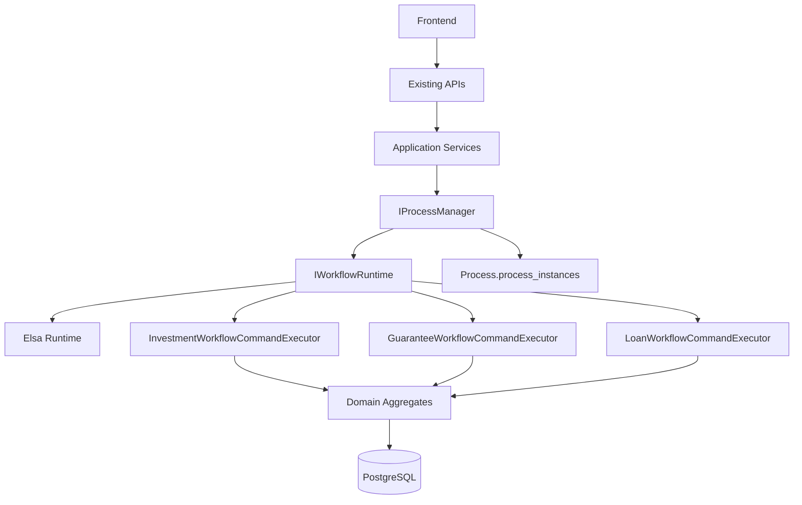

# Elsa BPMS Implementation Status

Date: 2026-06-26

## Completed

- Added a process management facade over Elsa:
  - `IProcessManager`
  - `IWorkflowRuntime`
  - `IWorkflowCommandDispatcher`
  - `IProcessReadModelProjector`
- Updated investment, guarantee, loan, and rollback application flows to call the process layer instead of directly depending on Elsa orchestrators.
- Preserved existing controllers, routes, DTOs, auth model, authorization model, frontend workflow models, and numeric status/phase contracts.
- Added `ElsaWorkflowRuntime` as the only application-facing Elsa adapter.
- Added durable process correlation:
  - `ProcessInstance`
  - `ProcessExecutionStatus`
  - `CoreDbContext.ProcessInstances`
  - `Process.process_instances` EF Core migration
- Expanded code-defined Guarantee and Loan workflow skeletons from a single wait loop into explicit BPMS stage flows.
- Migrated Loan workflow authority out of `LoanCaseStateManager`:
  - Loan write actions now dispatch through `IProcessManager`.
  - `ElsaWorkflowRuntime` resolves Loan routes through workflow-owned routing.
  - `LoanWorkflowCommandExecutor` validates domain/application rules and persists requested mutations.
  - Loan `AllowedActions` projections now use `ILoanWorkflowActionProvider`.
  - `LoanCaseStateManager` and `ILoanCaseStateManager` were removed.
- Migrated Investment workflow authority out of `CaseStateManager`:
  - Investment write actions now dispatch through `IProcessManager`.
  - `ElsaWorkflowRuntime` resolves Investment routes through workflow-owned routing.
  - `InvestmentWorkflowCommandExecutor` validates existing domain/application rules and persists requested mutations.
  - Investment `AllowedActions` projections now use `IInvestmentWorkflowActionProvider`.
  - Active `CaseStateManager` workflow authority was removed.
- Migrated Guarantee workflow authority out of `GuaranteeCaseStateManager`:
  - Guarantee write actions now dispatch through `IProcessManager`.
  - `ElsaWorkflowRuntime` resolves Guarantee routes through workflow-owned routing.
  - `GuaranteeWorkflowCommandExecutor` validates existing domain/application rules and persists requested mutations.
  - Guarantee `AllowedActions` projections now use `IGuaranteeWorkflowActionProvider`.
  - `GuaranteeCaseStateManager` and `IGuaranteeCaseStateManager` were removed.
- Removed legacy phase-review `CaseStateManager` and `ReviewService` registration that carried obsolete workflow ownership.
- Completed final Elsa-first routing cleanup:
  - Removed `InvestmentWorkflowRouteResolver`, `GuaranteeWorkflowRouteResolver`, and `LoanWorkflowRouteResolver`.
  - Replaced generic `status-changed` workflow waits with `WaitForCaseCommandActivity` command bookmarks.
  - Updated `InvestmentCaseWorkflow`, `GuaranteeCaseWorkflow`, and `LoanCaseWorkflow` so command, role, target status, branches, revision loops, cancellation paths, archive paths, and completion paths are expressed in workflow definitions.
  - Updated `ElsaWorkflowRuntime` to read active Elsa bookmark metadata instead of calculating next status in application code.
  - Updated allowed-action projections to read active Elsa command bookmarks rather than enumerating transition tables.
  - Removed obsolete signal bookmark activity/stimulus code and made legacy status signal methods no-op compatibility hooks.
  - Removed unused domain transition-mirroring helper overloads; only kanban ownership mirroring remains.

## Database

Generated migration:

- `src/Services/CoreService/Core.Persistence/Migrations/20260626125010_AddProcessInstances.cs`

This migration creates:

- schema: `Process`
- table: `process_instances`
- unique index: `(Module, CaseId)`
- indexes for `WorkflowInstanceId`, `(Module, Status)`, and `LastCommandCorrelationId`

Because the target database does not exist yet, this is a clean-schema migration path. No production data backfill was designed or required.

## Remaining Hardening

The internal routing authority migration is complete for Investment, Guarantee, and Loan. Remaining hardening is operational rather than workflow ownership:

- Add dedicated integration tests once a test project exists.
- Add SLA/timer/escalation designer governance when business policy values are available.
- Replace code-defined workflow definitions with externally published Elsa designer definitions only after versioning governance is approved.

## Architecture Position

The current codebase is now in a safe intermediate state:

The frontend remains unaware of Elsa. Domain state columns remain compatibility read models. Elsa correlation is durable. Transition routing for Investment, Guarantee, and Loan now lives in the workflow layer; application services dispatch semantic process commands and executors call the domain/application rules.

## Completion Statement

The Elsa-first BPMS migration target is implemented internally without changing REST routes, DTOs, authentication, authorization, or frontend workflow contracts. Workflow routing authority now resides in Elsa workflow definitions and active command bookmarks. PostgreSQL remains the business source of truth through existing case/status/history tables plus the new process correlation table.
