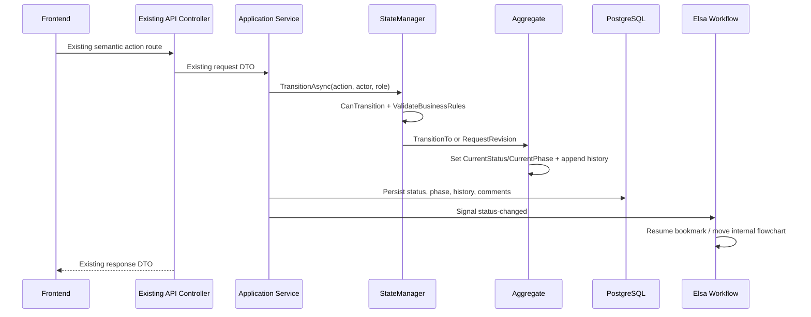
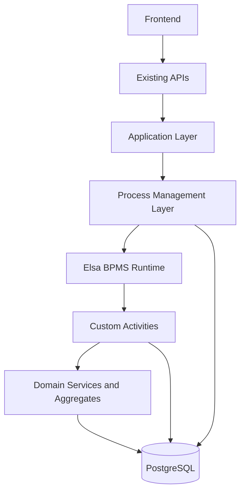
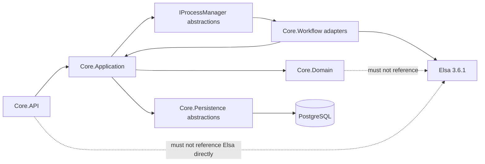
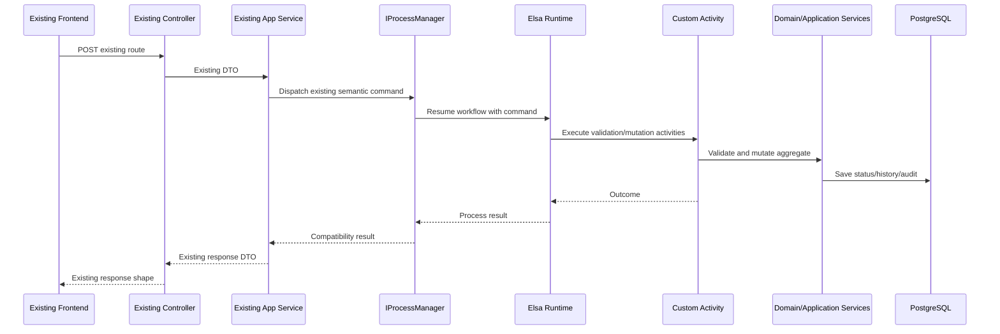
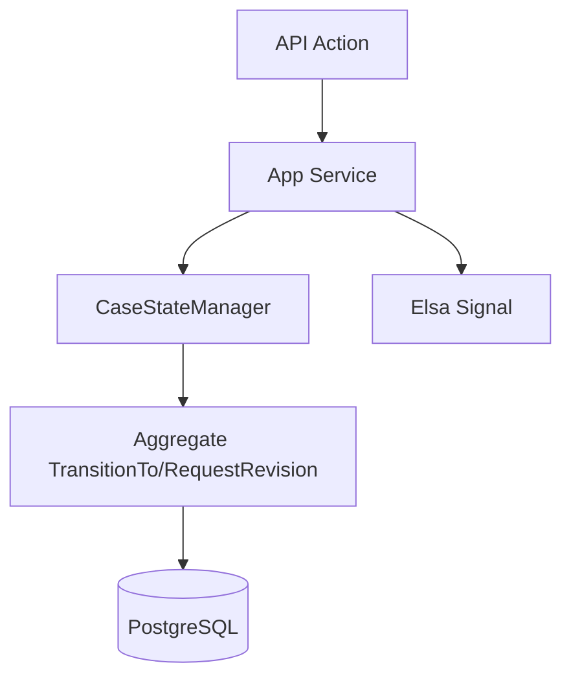
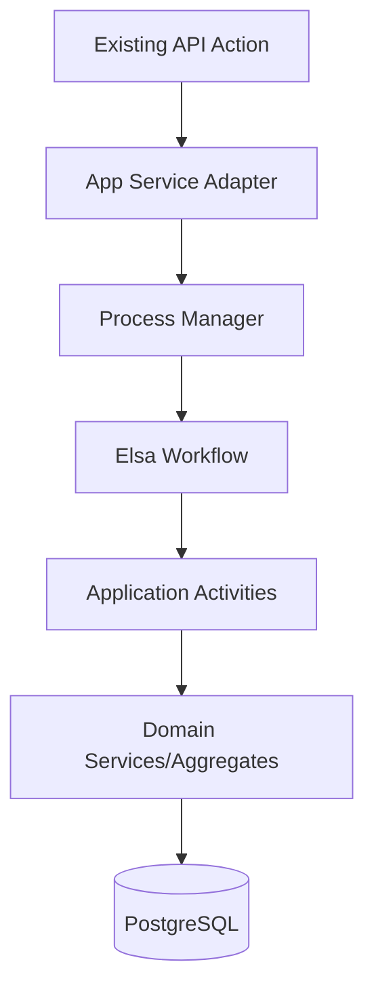
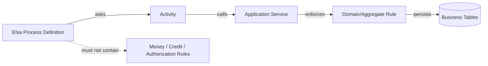

# Elsa BPMS Migration Assessment and Implementation Plan

**Document type:** Architecture migration plan  
**Scope:** Financial-Core (`Maskan.Panel.sln`) - Investment, Guarantee, and Loan workflows  
**Target:** Elsa + BPMS as the process management layer over the domain  
**Compatibility rule:** Do not break existing APIs, DTOs, auth, authorization, frontend contracts, or UI workflow models  
**Database note:** No production database currently exists, so database updates can be applied as a clean schema evolution after the migration design is implemented.

This document supersedes the direction in `docs/backend/ELSA_WORKFLOW_ARCHITECTURE_ASSESSMENT.md` and `docs/backend/ELSA_WORKFLOW_INTEGRATION.md` without deleting them. Those documents correctly describe the current state: Elsa is passive today. This plan defines how to evolve the architecture so Elsa becomes the process-management layer while the domain remains the business authority.

---

## 1. Current Architecture

Financial-Core currently implements three application-owned state machines:

- Investment: `CaseStateManager`
- Guarantee: `GuaranteeCaseStateManager`
- Loan: `LoanCaseStateManager`

The API layer is contract-oriented and thin:

- `InvestmentCasesController`
- `GuaranteeCasesController`
- `LoanCasesController`

These controllers expose stable semantic REST routes such as `submit`, `approve`, `revision-request`, `ceo/approve`, `payments`, and document confirmation routes. They delegate to application services:

- `InvestmentCaseAppService`
- `GuaranteeCaseAppService`
- `LoanCaseAppService`
- `InvestmentWorkflowCoordinator` for investment transitions

The domain aggregates own persisted case state:

- `InvestmentCase`
- `GuaranteeCase`
- `LoanCase`

Each aggregate has `CurrentStatus`, `CurrentPhase`, `WorkflowInstanceId`, and workflow history collections:

- `InvestmentCaseWorkflowHistory`
- `GuaranteeCaseWorkflowHistory`
- `LoanCaseWorkflowHistory`

### Current Workflow Lifecycle

The current transition lifecycle is:



`CaseStateManager`, `GuaranteeCaseStateManager`, and `LoanCaseStateManager` currently own:

- Transition tables: `(CurrentStatus, Action, Role) -> NextStatus`
- Terminal-state checks
- Role expansion through `WorkflowRoleExpander`
- Allowed-action calculation
- Business precondition checks such as document completeness, worksheet validity, guarantee amendment routing, loan installment readiness, and payment completion gates
- Idempotency checks using `CorrelationId` in workflow history

The aggregate methods `TransitionTo`, `RequestRevision`, and `RollbackTo` mutate `CurrentStatus` and `CurrentPhase`, derive the new phase, set completion timestamps, and append workflow-history records.

### Current Elsa Responsibilities

Elsa is integrated in `Core.Workflow`:

- `InvestmentCaseWorkflow`
- `GuaranteeCaseWorkflow`
- `LoanCaseWorkflow`
- `WaitForCaseSignalActivity`
- `ElsaCaseWorkflowOrchestrator`
- `ElsaGuaranteeWorkflowOrchestrator`
- `ElsaLoanWorkflowOrchestrator`

`Core.Workflow/DependencyInjection/ServiceCollectionExtensions.cs` registers Elsa. In non-development environments it uses PostgreSQL through Elsa EF Core management/runtime persistence.

Current Elsa behavior:

- On case creation, an Elsa workflow instance is started with `InstanceId = caseId.ToString("D")`.
- The case stores this value in `WorkflowInstanceId`.
- After the application commits a domain transition, the app signals Elsa with `WorkflowSignals.StatusChanged`.
- `WaitForCaseSignalActivity` creates bookmarks and resumes when `CaseSignalStimulus { CaseId, Signal }` matches.
- If bookmark resume fails, the orchestrators try to reset the Elsa instance and continue logging warnings.

Elsa does not currently decide transitions, enforce authorization, validate documents, mutate case state, write business history, calculate allowed actions, drive kanban, or trigger the main workflow side effects. It is a passive companion and internal flow-position tracker.

### Current API Flow

The API contract is stable and must remain stable. Existing controllers and DTOs represent the public boundary. The frontend also has hard-coded workflow models:

- `Frontend/js/workflow-model.js`
- `Frontend/js/guarantee-workflow-model.js`
- `Frontend/js/loan-workflow-model.js`

These models expect numeric statuses, phases, existing routes, current case details, history, allowed actions, and kanban payloads. The migration must preserve those expectations.

---

## 2. Target Architecture

The target architecture is:



The target dependency rule:



Elsa should manage:

- Process flow and stage sequencing
- Approval routing
- Revision loops
- Waiting for external/user actions
- Timers, reminders, SLA, and escalation
- Workflow definition versioning
- Operational process visibility

Domain/application should still manage:

- Financial calculations
- Credit and fund-limit invariants
- Authorization and role rules
- Aggregate mutations
- Document and application validation
- Audit history as business records
- Persistence consistency

`CurrentStatus`, `CurrentPhase`, `WorkflowInstanceId`, and `*CaseWorkflowHistory` remain during migration as compatibility fields and business audit records. They should not be removed in the first migration because API responses, kanban, dashboards, SMS, and frontend workflow models depend on them.

---

## 3. API Compatibility Strategy

The migration can keep the external API unchanged.

Keep unchanged:

- Controller names and routes
- Request DTOs
- Response DTOs
- HTTP status behavior
- Auth and authorization policies
- Existing frontend workflow models
- Existing semantic action names

The application services become adapters from current REST commands to process commands. For example:

- `SubmitDataEntry1Async` remains callable exactly as today.
- Internally it dispatches a process command such as `Investment.SubmitDataEntry1`.
- The process layer resumes or starts the relevant Elsa workflow.
- Elsa runs activities that call domain/application services to validate and mutate state.
- The compatibility read model still returns `CurrentStatus`, `AllowedActions`, and `WorkflowHistory`.

### Adapter Flow



This preserves the frontend because the visible contract remains the same. Elsa becomes an internal orchestration engine hidden behind application-level abstractions.

---

## 4. New Process Management Layer

Introduce a process management layer in application abstractions. This layer hides Elsa from controllers, app services, domain entities, and frontend contracts.

### `IProcessManager`

Case-module neutral orchestration facade.

Responsibilities:

- Start a process for a new case.
- Dispatch a process command for an existing case.
- Resume a waiting workflow.
- Query process metadata required by compatibility projections.
- Return application-level success/failure results, not Elsa-specific types.

Example contract shape:

```csharp
public interface IProcessManager
{
    Task<Result<ProcessStartResult>> StartAsync(ProcessStartCommand command, CancellationToken ct);
    Task<Result<ProcessCommandResult>> DispatchAsync(ProcessCommand command, CancellationToken ct);
    Task<Result<ProcessSnapshot>> GetSnapshotAsync(CaseModuleType module, Guid caseId, CancellationToken ct);
}
```

### `IWorkflowRuntime`

Elsa runtime adapter.

Responsibilities:

- Dispatch Elsa workflow definitions.
- Resume by bookmark/signal/command.
- Map Elsa failures to application errors.
- Manage definition version and workflow instance IDs.
- Encapsulate `IWorkflowDispatcher`, `IWorkflowResumer`, `IBookmarkStore`, and `IWorkflowInstanceManager`.

Only `Core.Workflow` should implement this interface.

### `IWorkflowCommandDispatcher`

Command mapping boundary.

Responsibilities:

- Convert existing semantic API actions to process commands.
- Normalize module-specific actions into internal command names.
- Include actor context, role, correlation ID, comments, and source route metadata.
- Ensure current API routes do not leak Elsa activity IDs or bookmark names.

### `IProcessReadModelProjector`

Compatibility projection service.

Responsibilities:

- Project process state into `CurrentStatus`, `CurrentPhase`, `AllowedActions`, and history-compatible views.
- Keep kanban, dashboards, case detail, and frontend models stable.
- Optionally compare Elsa process state against persisted domain status during migration and report drift.

### Layering Rule

`Core.Application` may define the abstractions and command/result records. `Core.Workflow` implements Elsa-specific runtime details. `Core.Domain` must not reference Elsa.

---

## 5. Migration of StateManager

Current model:



Target model:



Move to Elsa:

- Route from one stage to the next.
- Revision-loop structure.
- Approval-step ordering.
- Wait states.
- SLA timers and escalations.
- Process versioning and upgrade policy.
- Human/process task ownership as orchestration metadata.

Keep in domain/application:

- Money calculations and amount validation.
- Guarantee fund-credit checks.
- Loan installment and repayment rules.
- Document completeness rules.
- Application completeness rules.
- Authorization and permission checks.
- Aggregate mutation and audit history.
- Idempotency and correlation safety.

Become custom activities:

- Current `CanTransition` checks become `AuthorizeCaseActionActivity` and compatibility guards during the transition period.
- Current `ValidateBusinessRules` blocks become explicit validation activities that call domain/application services.
- Current `TransitionTo` and `RequestRevision` calls become `ChangeCaseStatusActivity` and `RequestRevisionActivity`.
- Current SMS calls become `SendNotificationActivity`.
- Current history inserts remain domain audit operations, called through `RecordWorkflowHistoryActivity` or aggregate mutation.

### Transition Strategy

Do not remove state managers immediately. Use them in phases:

1. Keep them as the source of truth while introducing `IProcessManager`.
2. Run Elsa in command-aware mode and compare outcomes against state-manager decisions.
3. Promote Elsa to routing owner for one module at a time.
4. Keep state managers as compatibility validators until parity is proven.
5. Retire transition dictionaries only after characterization tests and operational drift checks pass.

---

## 6. Elsa Workflow Design

### Investment Workflow

Stages:

1. Draft created.
2. Data Entry 1.
3. Review Data Entry 1.
4. Revision loop to Data Entry 1 when requested.
5. Data Entry 2.
6. Review Data Entry 2.
7. Revision loop to Data Entry 2 when requested.
8. Initial valuation.
9. Secondary valuation.
10. Preliminary contract upload.
11. Applicant review of preliminary contract.
12. Revision loop to legal preliminary contract.
13. Contract drafting.
14. Contract signature confirmation.
15. Signed contract upload.
16. Financial worksheet entry.
17. Financial worksheet review.
18. Revision loop to worksheet entry.
19. CEO approval.
20. CEO revision loop to finance.
21. Payment waiting and payment completion.
22. Completion, rejection, cancellation, or archive.

Elsa owns the stage routing and waits. Activities call the domain/application layer for:

- Applicant profile completeness.
- Attraction-basis completeness.
- Required investment documents.
- Valuation persistence.
- Financial worksheet validity.
- Confirmed payment sum versus approved amount.

### Guarantee Workflow

Main stages:

1. Draft.
2. Application/data entry.
3. Credit review.
4. Approval form entry.
5. CEO initial approval.
6. Draft contract upload.
7. Applicant signed package and attachments.
8. Financial attachment review.
9. Final contract upload.
10. CEO final approval.
11. Issuance documents.
12. Completed, rejected, cancelled, or archived.

Amendment/cancellation subprocess:

1. Begin amendment from completed/approved/rejected amendment state.
2. Amendment data entry.
3. Optional credit review for reductions or cancellation rules.
4. CEO amendment approval.
5. Legal review for extension/reduction where required.
6. Apply approved amendment or complete cancellation.
7. Amendment approved, rejected, completed, or cancelled.

Elsa owns the subprocess routing. Domain/application services retain:

- `GuaranteeApplicationCompleteness`
- `GuaranteeApprovalFormCompleteness`
- `GuaranteeDocumentRequirements`
- `GuaranteeAmendmentCompleteness`
- Fund-credit limit checks
- Amendment amount/date bounds
- Cancellation settlement and legal override rules

### Loan Workflow

Stages:

1. Draft.
2. Application/data entry.
3. Credit review.
4. Credit revision loop.
5. CEO initial approval.
6. Legal raw contract and installment setup.
7. Applicant signed package.
8. Legal final review.
9. Legal revision loop.
10. Financial review.
11. Financial revision loop.
12. Legal final contract upload.
13. CEO final approval.
14. Ready for payment.
15. Payment registration.
16. Repayment phase.
17. Repayment completion.
18. Completed, cancelled by CEO, or archived.

Elsa owns flow and waits. Domain/application services retain:

- `LoanApplicationCompleteness`
- `LoanApprovalDetailCompleteness`
- `LoanDocumentRequirements`
- Installment validation
- Payment registration rules
- Repayment completion rules

---

## 7. Custom Activities Design

| Activity | Input | Output | Responsibility |
|----------|-------|--------|----------------|
| `AuthorizeCaseActionActivity` | Module, case ID, action, actor ID, actor roles, current status | Authorized/forbidden outcome | Enforce existing API/application authorization and role rules before process movement. |
| `ValidateDocumentsActivity` | Module, case ID, document stage/type context | Valid/invalid outcome with message | Call document requirement services such as `GuaranteeDocumentRequirements`, `LoanDocumentRequirements`, and investment document rules. |
| `ValidateApplicationCompletenessActivity` | Module, case ID, stage | Valid/invalid outcome | Call completeness services such as `GuaranteeApplicationCompleteness`, `LoanApplicationCompleteness`, and investment data-entry checks. |
| `CheckFundCreditActivity` | Guarantee case ID, requested amount/context, actor | Approved/rejected fund-credit outcome | Enforce guarantee fund-credit constraints. This is a domain/application rule, not workflow JSON logic. |
| `ApproveCaseActivity` | Module, case ID, approval stage, actor, comments | Approval outcome | Record approval intent and delegate actual status mutation to domain/application services. |
| `RequestRevisionActivity` | Module, case ID, target stage/status, actor, message | Revision outcome | Add revision comment/history and route the workflow back to the correct wait state. |
| `ChangeCaseStatusActivity` | Module, case ID, target status, actor, action, correlation ID, comment | Persisted status result | Call aggregate/application mutation so `CurrentStatus`, `CurrentPhase`, and timestamps remain compatible. |
| `RecordWorkflowHistoryActivity` | Module, case ID, from/to state, actor, action, correlation ID, comment | History ID/result | Ensure business audit history stays in existing `*CaseWorkflowHistory` tables. |
| `SendNotificationActivity` | Module, case ID, from/to status, action, recipients | Notification result | Trigger existing workflow SMS/notification infrastructure after successful domain state change. |
| `ScheduleSlaTimerActivity` | Module, case ID, stage, due time, escalation policy | Timer scheduled | Use Elsa timer/delay capabilities for SLA reminders and escalations. |
| `EscalateCaseActivity` | Module, case ID, stage, overdue duration, target role | Escalation result | Notify managers/CEO or mark process as escalated without changing financial/domain invariants. |
| `CompletePaymentGateActivity` | Module, case ID, payment context | Complete/wait outcome | Check payment completion through domain/application services before moving to final completion. |

Activity implementation rules:

- Activities may call application services and repositories.
- Activities must not duplicate financial formulas, role policy definitions, or aggregate invariants.
- Activities must return structured outcomes, not throw for expected business rejection.
- Activities must use correlation IDs for idempotent command handling.

---

## 8. Domain Boundary Rules

The following must not move into Elsa definitions, workflow JSON, or designer-only logic:

- Money calculations.
- Payment sum and approved amount comparison.
- Guarantee fund-credit and credit-limit invariants.
- Loan repayment completion rules.
- Authorization and permission decisions.
- Aggregate mutation rules.
- Document completeness rules.
- Application completeness rules.
- Amendment amount/date validation.
- Cancellation settlement/legal override validation.
- Audit history semantics.
- Repository scoping for applicant/internal access.
- Idempotency based on correlation ID.
- Soft-delete and ownership filters.

Elsa may orchestrate when these checks happen. It must not become the owner of these rules.

The banking-platform boundary is:



---

## 9. Database Changes

The user confirmed that the production database does not exist. That changes the migration strategy: do not design a production backfill-first migration. Instead, implement the process-layer changes and then generate/apply a clean database update path.

### Keep Initially

Keep these existing compatibility fields and tables:

- `CurrentStatus`
- `CurrentPhase`
- `WorkflowInstanceId`
- `case_workflow_history`
- `guarantee_case_workflow_history`
- `loan_case_workflow_history`

Reason: existing APIs, frontend models, kanban, dashboards, SMS, and audit/reporting paths depend on them.

### Add / Enable

Enable durable Elsa 3.6.1 runtime/management persistence through PostgreSQL for all environments that need reliable workflow testing, not only production. Current registration already uses:

- `UseWorkflowManagement(...UsePostgreSql(connectionString))`
- `UseWorkflowRuntime(...UsePostgreSql(connectionString))`

The schema should include Elsa management/runtime tables after migration.

### Optional Process Correlation Table

Add a small process correlation table only if Elsa metadata is not sufficient for query/reporting and drift detection.

Recommended columns:

- `Id`
- `Module`
- `CaseId`
- `WorkflowInstanceId`
- `WorkflowDefinitionId`
- `WorkflowDefinitionVersion`
- `ProcessStatus`
- `CurrentProcessStep`
- `StartedAt`
- `UpdatedAt`
- `CompletedAt`
- `LastCommandCorrelationId`

Indexes:

- Unique `(Module, CaseId)`
- Index `WorkflowInstanceId`
- Index `(Module, ProcessStatus)`

### Migration Impact

Because no production database exists:

1. Implement the process layer and activity design.
2. Update EF model and Elsa persistence configuration.
3. Generate a clean migration or rebuild the migration chain according to the team's database policy.
4. Create the database after the migration design is stable.
5. Run smoke tests against Investment, Guarantee, and Loan flows.

Do not remove existing status/history columns in the first BPMS migration.

---

## 10. Frontend Impact

The frontend must continue using:

- `CurrentStatus`
- `CurrentPhase`
- `AllowedActions`
- `WorkflowHistory`
- Existing semantic REST endpoints
- Existing document and payment endpoints

Frontend files that must remain contract-compatible:

- `Frontend/js/workflow-model.js`
- `Frontend/js/guarantee-workflow-model.js`
- `Frontend/js/loan-workflow-model.js`
- `Frontend/js/portal.js`
- `Frontend/js/guarantee-portal.js`
- `Frontend/js/loan-portal.js`
- `Frontend/js/kanban.js`

The frontend should not know Elsa exists.

Compatibility strategy:

- Keep numeric status values stable.
- Keep phase values stable.
- Keep response DTO names and field names stable.
- Keep kanban `allowedActions` stable.
- Continue returning history from business history tables, not raw Elsa instance logs.
- Optionally add internal diagnostics endpoints later, but do not change the current frontend contract.

If process state and domain status diverge during migration, the backend must prefer the compatibility projection and log drift for operators. The frontend should not receive partial or Elsa-specific state.

---

## 11. Migration Phases

### Phase 1: Introduce Process Layer

- Add `IProcessManager`, `IWorkflowRuntime`, `IWorkflowCommandDispatcher`, and `IProcessReadModelProjector`.
- Keep current state managers as source of truth.
- Route app services through process abstractions where feasible while preserving behavior.
- Add drift logging comparing process intent and persisted domain status.
- Add characterization tests for current transition tables before moving ownership.

### Phase 2: Make Elsa Durable and Command-Aware

- Ensure Elsa PostgreSQL persistence is enabled for migration/test environments.
- Replace generic `status-changed` only signaling with semantic commands/signals.
- Include module, case ID, action, actor, role, comments, and correlation ID in process commands.
- Store or project workflow definition version per case.

### Phase 3: Move Process Decisions for One Pilot Module

- Choose Loan as the first candidate because its flow is smaller than Investment and less dynamic than Guarantee amendment/cancellation.
- Elsa owns stage routing for Loan.
- Activities call existing validation/mutation code.
- Persist `CurrentStatus`, `CurrentPhase`, and workflow history exactly as before.
- Compare allowed actions and final statuses against current `LoanCaseStateManager`.

### Phase 4: Migrate Investment

- Replace investment transition routing with an Elsa workflow that models the full process.
- Keep financial worksheet, valuation, contract, and payment validation in domain/application services.
- Preserve all existing investment API routes.
- Keep `InvestmentWorkflowCoordinator` as the adapter until callers are fully switched to `IProcessManager`.

### Phase 5: Migrate Guarantee and Amendment/Cancellation

- Model the main guarantee workflow.
- Model amendment/cancellation as a subprocess or explicit branch.
- Keep fund-credit, amendment validation, legal override, and settlement checks outside Elsa definitions.
- Validate dynamic routing such as cancellation and reductions through activities.

### Phase 6: Enable BPMS Designer Governance

- Introduce controlled workflow definition versioning.
- Define who may publish workflow definitions.
- Require review gates for changes affecting status transitions.
- Add process observability dashboards.
- Add SLA/timer/escalation workflows.

### Phase 7: Retire Old Transition Ownership

- Remove state-manager transition dictionaries only after parity tests pass.
- Keep compatibility read projections until the frontend is intentionally redesigned.
- Keep domain audit history permanently unless a separate regulatory audit model replaces it.

---

## 12. Risks

### Dual Ownership

During migration, state managers and Elsa may both appear to own flow decisions. This must be controlled by module-level feature flags or routing policies. Only one component may decide the next process step for a given module at a time.

### Transaction Consistency

Today the app writes domain state first and signals Elsa best-effort. Elsa-first routing introduces the opposite risk: Elsa advances but domain persistence fails. Use one of these strategies:

- Execute domain mutation as an Elsa activity and treat persistence failure as process failure.
- Use an outbox/inbox pattern for cross-boundary consistency.
- Keep process status and domain status in the same database transaction where practical.

### Rollback

`CaseStageRollbackAppService` currently bypasses normal transition tables and calls aggregate rollback behavior. Elsa does not currently model compensation. Rollback must remain an application-admin operation until explicit compensation workflows are designed.

### Versioning

Elsa workflow definitions can version independently from domain enums and frontend workflow models. The migration must define active-instance policy:

- Existing instances continue on their original definition version.
- New instances use the latest approved version.
- Manual migration between versions requires a controlled operator workflow.

### Debugging

Operators currently inspect SQL `CurrentStatus` and workflow history. After migration, debugging spans:

- Elsa instance state
- Elsa bookmarks
- Process correlation state
- Domain case status
- Business workflow history
- Application logs

Add correlation IDs and drift reports early.

### Production Migration

No production database exists now, but production migration risk still matters later. Do not remove compatibility fields before the platform has live BPMS observability and tests.

### Package-Version Ambiguity

`src/Directory.Packages.props` uses Elsa 3.6.1. The repository root `Directory.Packages.props` still lists Elsa 2.13.1. The service appears to use the `src` package props, but this ambiguity should be cleaned up before BPMS migration work to avoid accidental package downgrade or tooling confusion.

### Missing Test Safety Net

The repository does not show a mature automated test suite for these workflows. Before changing transition authority, add characterization tests around:

- Existing state-manager transitions.
- Business validation failures.
- Revision loops.
- Guarantee amendments/cancellations.
- Loan legal/financial revision loops.
- Investment payment completion.

---

## 13. Final Recommendation

This migration is technically possible.

The recommended architecture is not a product rewrite and not a frontend rewrite. It is an internal orchestration migration:

- Keep existing APIs and frontend contracts.
- Introduce a process management layer.
- Hide Elsa behind application abstractions.
- Move process routing and long-running orchestration into Elsa.
- Keep financial rules, authorization, aggregate mutation, and audit history in domain/application code.
- Preserve `CurrentStatus`, `AllowedActions`, and `WorkflowHistory` as compatibility read models.

Estimated effort: **medium-high to high**.

Reasoning:

- The codebase already has Elsa 3.6.1 and per-case workflow instances.
- The existing API layer is thin enough to adapt internally.
- The hard part is not adding Elsa; it is safely moving transition ownership away from `CaseStateManager`, `GuaranteeCaseStateManager`, and `LoanCaseStateManager` without breaking downstream status-based contracts.
- Guarantee amendment/cancellation and fund-credit checks make a big-bang migration too risky.

Recommended implementation order:

1. Introduce the process abstraction layer.
2. Make Elsa durable and command-aware.
3. Pilot Loan.
4. Migrate Investment.
5. Migrate Guarantee and amendment/cancellation.
6. Enable BPMS designer/version governance.
7. Retire old transition ownership only after parity and observability are proven.

The banking-platform architecture to choose is:

> Elsa as process manager over the domain, not Elsa as the domain.

This preserves the product contract while gaining BPMS capabilities such as visual process definitions, timers, SLA, escalation, waiting, routing, and workflow versioning.

